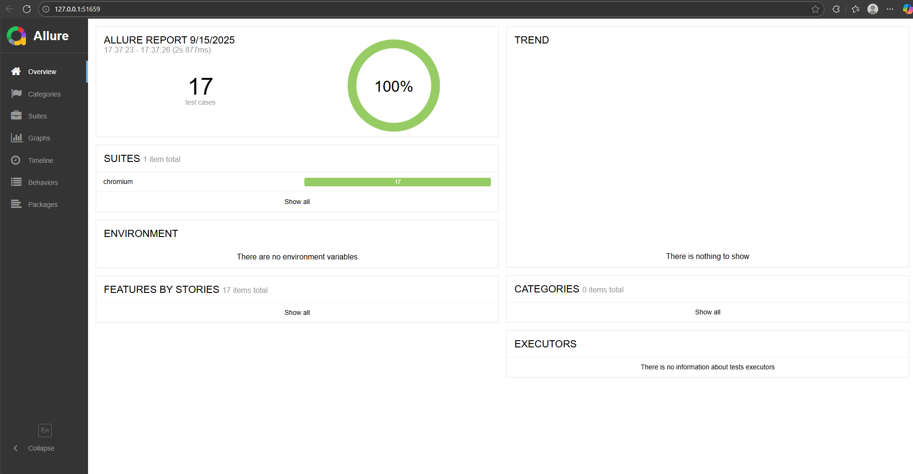
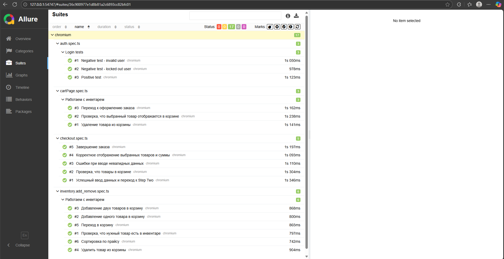
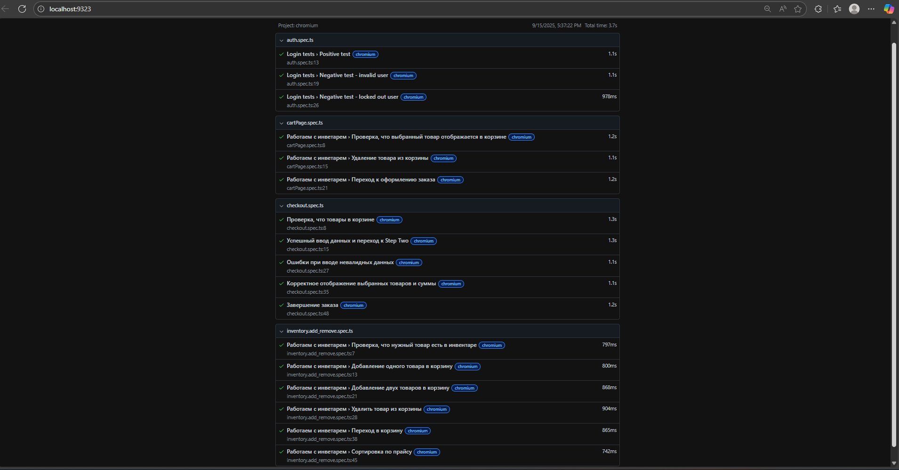

# 🧪 Playwright Automation Project — SauceDemo

Проект автотестов на [SauceDemo](https://www.saucedemo.com/)  
Реализован как учебный, но оформлен в виде полноценного портфолио.

---

## 🎯 Цели проекта

- Показать навыки автоматизации тестирования UI с использованием **Playwright + TypeScript**.
- Использовать **Page Object Model (POM)** для структурированного кода.
- Научиться писать позитивные и негативные тесты.
- Реализовать end-to-end сценарий: **Login → Inventory → Cart → Checkout**.
- Продемонстрировать отчётность через **Allure Report**.

---

## 🏗 Стек технологий

- **Playwright** — e2e тестирование
- **TypeScript** — типизация и читаемость кода
- **POM (Page Object Model)** — структурирование тестов
- **Allure Report** — визуализация результатов
- **Node.js / npm** — окружение и пакетный менеджер

---

## 📂 Структура проекта

```
├── pages/ # Page Object классы (LoginPage, InventoryPage, CartPage, CheckoutPage)
├── tests/ # Тесты (позитивные, негативные, e2e сценарии)
├── fixtures/ # Фикстуры (авторизация и переиспользуемые шаги)
├── utils/ # Тестовые данные (пользователи, продукты)
├── assets/ # Скриншоты отчетов (для README)
├── playwright.config.ts
└── README.md
```

---

## ✅ Реализованные тесты

### 🔐 LoginPage

- Позитивный логин (`standard_user`)
- Негативные кейсы:
  - пустой логин
  - пустой пароль
  - неверный пароль
  - заблокированный пользователь (`locked_out_user`)

### 📦 InventoryPage

- Проверка наличия товаров
- Добавление товара в корзину → бейджик обновляется
- Удаление товара → бейджик исчезает
- Добавление 2 товаров → удаление 1 → бейджик корректный
- Проверка сортировки (Price low→high)
- Переход в Cart

### 🛒 CartPage

- Проверка, что выбранные товары отображаются
- Удаление товара из корзины
- Переход к Checkout

### 📝 CheckoutPage

- Заполнение формы (Step One) и успешное завершение заказа (Step Complete)
- Негативный кейс: ошибка при пустом поле
- Проверка итоговой суммы и списка товаров
- 

---

## ▶️ Установка и запуск пошагово

```bash
# 1. Клонировать репозиторий
git clone https://github.com/<твоя-ссылка>/plw-demoqa-tests.git
cd plw-demoqa-tests

# 2. Установить зависимости
npm install

# 3. Запустить тесты
npx playwright test

## 📜 Доступные npm-скрипты

- `npm run test` — запустить все тесты
- `npm run test:chromium` — запустить только в Chromium
- `npm run test:headed` — запустить в headed-режиме (видимый браузер)
- `npm run test:ui` — открыть Playwright UI
- `npm run codegen` — запустить Playwright Codegen (запись шагов)
```

## 📊 Отчёты

Проект настроен на использование **Allure Report**.  
После запуска тестов дотступен Allure отчет:

``` bash
npx playwright test
npx allure generate ./allure-results --clean -o ./allure-report
npx allure open ./allure-report
```




После запуска тестов доступен HTML-репорт:
```bash
npx playwright show-report
```


---

## ⚙️ CI (GitHub Actions)

При каждом `push`/`PR` тесты запускаются автоматически:
- ставятся браузеры Playwright и зависимости,
- прогоняются все спеки,
- HTML-отчёт Playwright, трейс-файлы и (опционально) Allure прикладываются как артефакты к запуску.

[](https://github.com/MaksiLes/playwright-SAUSEDEMO-tests/actions/workflows/tests.yml)

См. вкладку **Actions** → последний workflow → **Artifacts**.

👩‍💻 Автор: **Olesia Ibragimova**  
📅 2025  

Этот проект — часть портфолио по автоматизации тестирования  
с использованием **Playwright + TypeScript**.