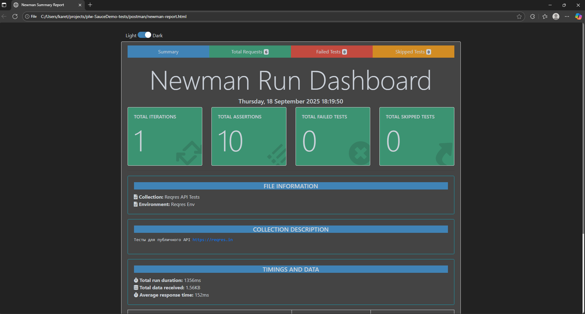

# 🧪 Playwright Automation Project — SauceDemo

Automated testing project for SauceDemo (https://www.saucedemo.com/).  
Developed as a learning project but structured as a complete portfolio example.

---

## 🎯 Project Goals

- Demonstrate UI automation testing skills using **Playwright + TypeScript**.
- Implement **Page Object Model (POM)** for clean and maintainable code.
- Practice writing positive and negative test cases.
- mplement an end-to-end scenario: **Login → Inventory → Cart → Checkout**.
- Demonstrate reporting through **Allure Report**.

---

## 🏗 Tech Stack

- **Playwright** — end-to-end testing
- **TypeScript** — type safety and readability
- **POM (Page Object Model)** — test structure organization
- **Allure Report** — result visualization
- **Node.js / npm** — environment and package manager

---

## 📂 Project Structure

```
├── pages/ # Page Object classes (LoginPage, InventoryPage, CartPage, CheckoutPage)
├── tests/ # Tests (positive, negative, end-to-end)
├── fixtures/ # Fixtures (authorization and reusable steps)
├── utils/ # Test data (users, products)
├── assets/ # Report screenshots (used in README)
├── playwright.config.ts
└── README.md
```

---

## ✅ Implemented Tests

### 🔐 LoginPage

- Positive login (`standard_user`)
- Negative cases:
  - empty username
  - empty password
  - invalid password
  - locked user (`locked_out_user`)

### 📦 InventoryPage

- Verify products are displayed
- Add product to cart → badge updates
- Remove product → badge disappears
- Add two products → remove one → badge count updates correctly
- Sort by “Price: low to high”
- Navigate to Cart

### 🛒 CartPage

- Verify selected products are shown
- Remove product from cart
- Proceed to Checkout

### 📝 CheckoutPage

- Fill out form (Step One) and successfully complete order (Step Complete)
- Negative case: error for empty required field
- Verify total price and product list

---

## ▶️ Installation and Run Guide

```bash
# 1. Clone the repository
git clone https://github.com/<your-link>/plw-demoqa-tests.git
cd plw-demoqa-tests

# 2. Install dependencies
npm install

# 3. Run tests
npx playwright test

## 📜 Available npm scripts

- `npm run test` — run all tests
- `npm run test:chromium` — run only in Chromium
- `npm run test:headed` — run tests in headed mode (visible browser)
- `npm run test:ui` — open Playwright UI mode
- `npm run codegen` — launch Playwright Codegen (step recording tool)
```

## 📊 Reports

The project is configured to use **Allure Report**.
The `allure-results` and `allure-report` folders are excluded from the repository (listed in .gitignore).
After running the tests, an Allure report can be generated.
If you cloned the project for the first time, follow these steps:

``` bash
# 1. Install dependencies
npm install
# 2. Install Playwright and browsers
npx playwright install
# 3. Run tests
npx playwright test
(  If the Allure reporter is not configured in `playwright.config.ts` ( i.e., the line reporter: [['html'], ['allure-playwright']] is missing ), then run the command below: 
npx playwright test --reporter="line,allure-playwright"
)
# 4. Generate the HTML report
npx allure generate ./allure-results --clean -o ./allure-report
# 5. Open the report in your browser
npx allure open ./allure-report

```


After running tests, the default Playwright HTML report is also available:

```bash
npx playwright show-report

```


---

## ⚙️ CI (GitHub Actions)

On each `push` or `pull request`, the tests run automatically:

- Playwright browsers and dependencies are installed.
- All specs are executed.
- The Playwright HTML report, trace files, and optionally Allure reports are uploaded as workflow artifacts

[](https://github.com/MaksiLes/playwright-SAUSEDEMO-tests/actions/workflows/tests.yml)

See the **Actions** tab → latest workflow → **Artifacts**.

## 🔌 API tests (reqres.in)

The project includes examples of testing the public API [Reqres](https://reqres.in) in two ways (with Postman collection and automated execution via Newman):

- **Playwright API** — `tests/api/reqres.spec.ts` (CRUD + 404 negative)  
  Run with: `npx playwright test tests/api`

- **Postman (Newman)** — collection and environment located in `/postman`  
  Run locally: `npm run api:postman`  
  
After execution, an HTML report is generated at `postman/newman-report.html`


👩‍💻 Author: **Olesia Ibragimova**  
📅 2025  

This project is part of a personal QA Automation Portfolio
built using **Playwright + TypeScript** .